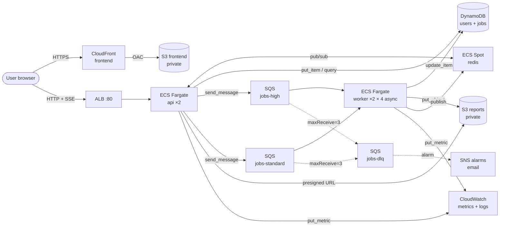

[](https://github.com/tiagosan44/santiago-patino-prosperas-challenge/actions/workflows/deploy.yml)

# Prosperas Full-Stack Challenge

> Async report processing system — FastAPI workers behind an SQS queue, React frontend with real-time updates over SSE, deployed to AWS via Terraform with full CI/CD.

**Author:** Santiago Patiño · 2026-04-26
**AI workflow:** see [`AI_WORKFLOW.md`](./AI_WORKFLOW.md)

## Production URLs

- **Frontend:** https://dk6ofz2gm79zv.cloudfront.net
- **API:** https://dk6ofz2gm79zv.cloudfront.net (same CloudFront, second origin)
- **API health:** https://dk6ofz2gm79zv.cloudfront.net/health
- **API docs:** https://dk6ofz2gm79zv.cloudfront.net/docs
- **Demo login:** `alice` / `secret123`

The frontend and API are both served from the same CloudFront distribution so the browser stays on a single HTTPS origin (no Mixed Content). CloudFront terminates TLS with its default certificate; the CloudFront → ALB hop is HTTP inside AWS. The deploy workflow prints the URLs in the GitHub Actions run summary on every push to `main`.

## Tech stack

| Layer | Stack |
|---|---|
| Backend API | Python 3.12, FastAPI, Pydantic v2, structlog, JWT (HS256) |
| Worker | asyncio (4 tasks per replica), `boto3` via `asyncio.to_thread` |
| Real-time | Server-Sent Events (SSE) + Redis pub/sub for multi-instance fan-out |
| Persistence | DynamoDB (multi-table) + S3 (lifecycle 30d) |
| Cache / coordination | Redis 7 (Fargate Spot, ephemeral) |
| Queues | SQS — `jobs-high`, `jobs-standard`, `jobs-dlq` (visibility 90s, redrive after 3 attempts) |
| Frontend | React 18 + TypeScript + Vite + Tailwind v3 + Zustand + react-hook-form + zod |
| Testing | pytest + moto + LocalStack (backend); Vitest + Testing Library + Playwright (frontend) |
| Infra | Terraform 1.9 + AWS provider 5.x — 11 modules, remote state in S3 + DynamoDB lock |
| CI/CD | GitHub Actions: PR (lint + tests + tf plan); push to `main` (build → ECR → tf apply → ECS rolling deploy → CloudFront invalidate → smoke `/health`) |

## Architecture



Key flows:

1. **Submit job:** `POST /jobs` → DynamoDB record `PENDING` → SQS `jobs-{high|standard}` → 201 to client.
2. **Process job:** worker `receive_message` → optimistic-lock transition to `PROCESSING` → simulate work (5–30 s) → upload result to S3 → update to `COMPLETED` → publish event to Redis.
3. **Real-time update:** every API replica subscribes to Redis on startup; an event published by any worker reaches every API; the API forwards it to the matching user's open SSE stream.
4. **Failure:** `ProcessingError` triggers exponential back-off (90 / 180 s) via `change_message_visibility`; on the 3rd attempt the job is marked `FAILED` and the user sees the error in the UI.

## Local setup

Requires Docker + Docker Compose. AWS credentials are NOT needed locally — LocalStack emulates the AWS services.

```bash
git clone https://github.com/tiagosan44/santiago-patino-prosperas-challenge.git
cd santiago-patino-prosperas-challenge
cp .env.example .env

cd local && docker compose up --build
```

That's it. The stack is up at:

- Frontend: http://localhost:5173
- API: http://localhost:8000
- API docs: http://localhost:8000/docs

Seed a test user (one-time):

```bash
docker compose exec api python -c "
from app.core import aws
from app.services import users as users_svc
table = aws.users_table()
try:
    users_svc.create_user(table, 'alice', 'secret123')
    print('created')
except users_svc.UsernameAlreadyExistsError:
    print('already exists')
"
```

Then sign in at http://localhost:5173 with `alice / secret123`.

To exercise the FAILED state, choose **"Force failure (demo)"** as the report type — the worker will retry 3 times with back-off and end with `FAILED`.

## Production setup

Production deploy is automated via GitHub Actions. To bootstrap a fresh AWS account:

1. Create an IAM user `prosperas-ci` with `AdministratorAccess` (rotate after the demo).
2. Configure the GitHub secrets listed in [`.github/SECRETS.md`](./.github/SECRETS.md).
3. Push to `main`. The deploy workflow:
   - Runs lint + tests
   - Builds api/worker images and pushes to ECR (tagged with the git SHA + `latest`)
   - Runs `terraform apply` (creates VPC, ECS cluster, ALB, DynamoDB, SQS, S3, CloudFront, IAM, alarms — see [`infra/terraform/`](./infra/terraform/))
   - Builds the frontend with the real ALB URL, syncs to S3, invalidates CloudFront
   - Force-rolls ECS services to the new task definitions
   - Smoke-tests `/health`
4. The deploy summary in the GitHub Actions run page contains the live URLs.

For local-only Terraform development, run `terraform plan` directly inside `infra/terraform/environments/prod/`.

## Decisions and trade-offs

A short overview is below; the full reasoning lives in [`TECHNICAL_DOCS.md`](./TECHNICAL_DOCS.md).

- **Fargate over Lambda** for the worker — long-running tasks with variable duration (5–30 s up to several minutes) sit in the awkward zone for Lambda. Fargate gives a stable container with the same image in dev and prod.
- **DynamoDB multi-table** instead of single-table — small entity count (users + jobs), explicit indexes per entity, simpler defense than Rick Houlihan-style single-table modeling.
- **SSE + Redis pub/sub** instead of WebSockets API Gateway — server-to-client only, HTTP/1.1 friendly, automatic reconnect via `EventSource`. Redis handles fan-out across multiple API replicas.
- **Custom exponential back-off** (B4) and **shared circuit breaker in Redis** (B2) — SQS only does linear redelivery natively; the worker calls `change_message_visibility` with growing timeouts, and the breaker uses Redis transactions for atomic state across replicas.
- **Single NAT gateway** in one AZ — accepted single-AZ failure risk for the ~$30/mo savings; documented as a production upgrade.
- **CloudFront in front of both frontend and API** — the demo doesn't have a domain for ACM, so the ALB is HTTP-only inside the VPC. CloudFront terminates HTTPS at the edge with its default certificate and proxies API paths (`/auth/*`, `/jobs`, `/jobs/*`, `/events/*`, `/health`, `/openapi.json`, `/docs`, `/docs/*`) to the ALB as a second origin. SSE paths use `compress=false` so CloudFront doesn't buffer event streams.

## Repository layout

```
.
├── backend/            FastAPI app + worker + tests (113 tests, 86% coverage)
│   ├── app/            api routers, models, services, core
│   ├── worker/         consumer, processor, circuit_breaker, asyncio main
│   └── tests/          unit + integration with moto/LocalStack
├── frontend/           Vite + React + TypeScript SPA
│   ├── src/            api, hooks, store (zustand), components, pages
│   └── tests/          vitest + Playwright E2E
├── local/              docker-compose for full local stack
├── infra/terraform/    11 modules + prod environment
│   ├── modules/        network, dynamo, sqs, sns, s3, ecr, iam, alb, ecs, cloudfront, observability
│   └── environments/prod/   composition root
├── .github/workflows/  CI (pr.yml) and CD (deploy.yml)
├── README.md           this file
├── TECHNICAL_DOCS.md   architecture, decisions, trade-offs
└── SKILL.md            agent-friendly project context
```

## Running tests

Backend:
```bash
cd backend
docker run --rm -v "$(pwd):/app" -w /app prosperas-api:dev \
  bash -c "pip install -q -r requirements-dev.txt && pytest --cov=app --cov=worker"
```

Frontend unit:
```bash
cd frontend
npm test
```

Frontend E2E (full stack must be up):
```bash
cd local && docker compose up -d && cd ../frontend
npx playwright install chromium  # first time only
npm run e2e
```
