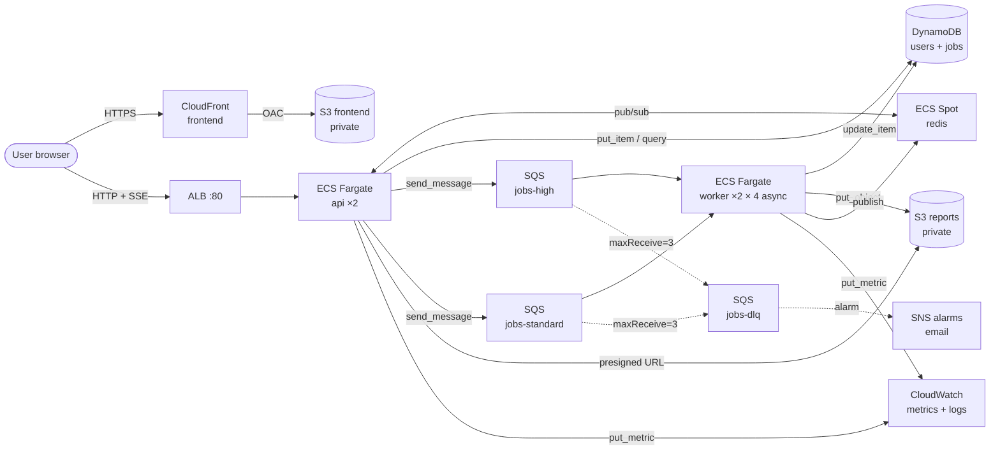
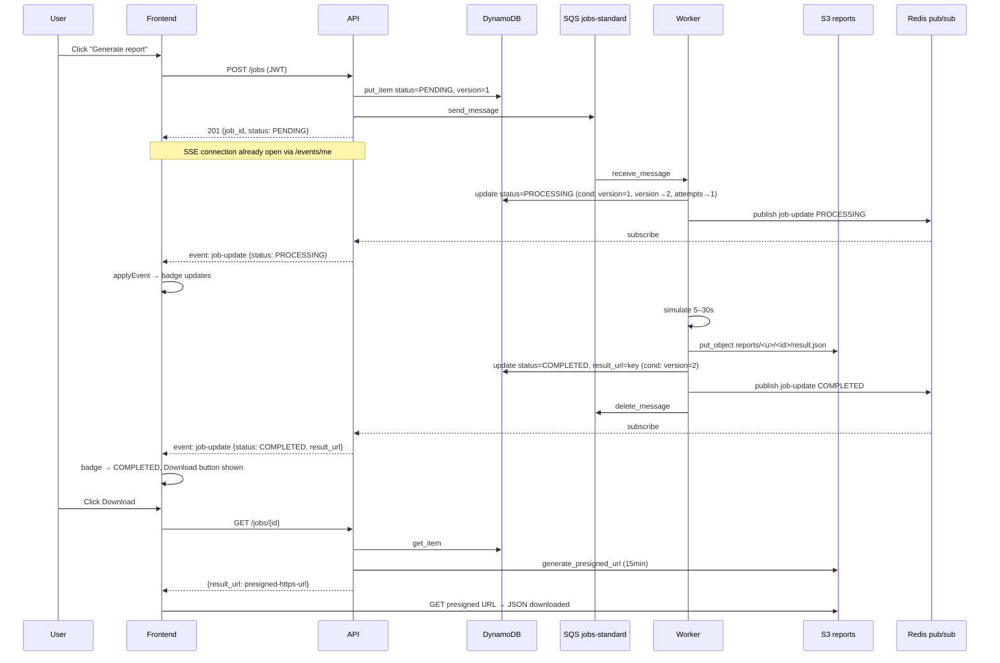
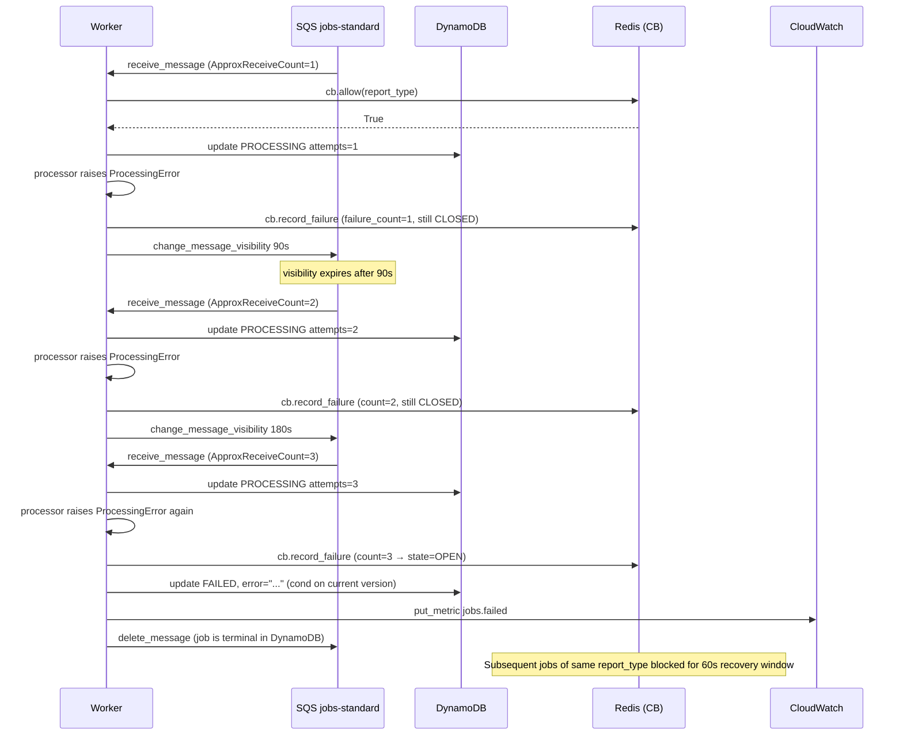

# Architecture diagrams

Linked from [`README.md`](../README.md) and [`TECHNICAL_DOCS.md`](../TECHNICAL_DOCS.md).

## Component diagram

```mermaid
flowchart LR
    User([User browser]) -->|HTTPS| CF[CloudFront<br/>frontend]
    User -->|HTTP + SSE| ALB[ALB :80]
    CF -->|OAC| S3F[(S3 frontend<br/>private)]
    ALB --> API[ECS Fargate<br/>api ×2]
    API <-->|pub/sub| Redis[ECS Spot<br/>redis]
    API -->|put_item / query| DDB[(DynamoDB<br/>users + jobs)]
    API -->|send_message| SQS_H[SQS<br/>jobs-high]
    API -->|send_message| SQS_S[SQS<br/>jobs-standard]
    API -->|presigned URL| S3R[(S3 reports<br/>private)]
    SQS_H --> Worker[ECS Fargate<br/>worker ×2 × 4 async]
    SQS_S --> Worker
    Worker -->|update_item| DDB
    Worker -->|put_object| S3R
    Worker -->|publish| Redis
    SQS_H -.->|maxReceive=3| DLQ[SQS<br/>jobs-dlq]
    SQS_S -.->|maxReceive=3| DLQ
    DLQ -.->|alarm| SNS[SNS alarms<br/>email]
    Worker -->|put_metric| CW[CloudWatch<br/>metrics + logs]
    API -->|put_metric| CW
```

## Job lifecycle (sequence)

```mermaid
sequenceDiagram
    participant U as User
    participant FE as Frontend
    participant API as API
    participant DDB as DynamoDB
    participant Q as SQS jobs-standard
    participant W as Worker
    participant S3 as S3 reports
    participant R as Redis pub/sub

    U->>FE: Click "Generate report"
    FE->>API: POST /jobs (JWT)
    API->>DDB: put_item status=PENDING, version=1
    API->>Q: send_message
    API-->>FE: 201 {job_id, status: PENDING}
    Note over FE,API: SSE connection already open via /events/me

    Q->>W: receive_message
    W->>DDB: update status=PROCESSING (cond: version=1, version→2, attempts→1)
    W->>R: publish job-update PROCESSING
    R-->>API: subscribe
    API-->>FE: event: job-update {status: PROCESSING}
    FE->>FE: applyEvent → badge updates

    W->>W: simulate 5–30s
    W->>S3: put_object reports/<u>/<id>/result.json
    W->>DDB: update status=COMPLETED, result_url=key (cond: version=2)
    W->>R: publish job-update COMPLETED
    W->>Q: delete_message
    R-->>API: subscribe
    API-->>FE: event: job-update {status: COMPLETED, result_url}
    FE->>FE: badge → COMPLETED, Download button shown
    U->>FE: Click Download
    FE->>API: GET /jobs/{id}
    API->>DDB: get_item
    API->>S3: generate_presigned_url (15min)
    API-->>FE: {result_url: presigned-https-url}
    FE->>S3: GET presigned URL → JSON downloaded
```

## Failure path (sequence)

```mermaid
sequenceDiagram
    participant W as Worker
    participant Q as SQS jobs-standard
    participant DDB as DynamoDB
    participant R as Redis (CB)
    participant CW as CloudWatch

    Q->>W: receive_message (ApproxReceiveCount=1)
    W->>R: cb.allow(report_type)
    R-->>W: True
    W->>DDB: update PROCESSING attempts=1
    W->>W: processor raises ProcessingError
    W->>R: cb.record_failure (failure_count=1, still CLOSED)
    W->>Q: change_message_visibility 90s
    Note over Q: visibility expires after 90s

    Q->>W: receive_message (ApproxReceiveCount=2)
    W->>DDB: update PROCESSING attempts=2
    W->>W: processor raises ProcessingError
    W->>R: cb.record_failure (count=2, still CLOSED)
    W->>Q: change_message_visibility 180s

    Q->>W: receive_message (ApproxReceiveCount=3)
    W->>DDB: update PROCESSING attempts=3
    W->>W: processor raises ProcessingError again
    W->>R: cb.record_failure (count=3 → state=OPEN)
    W->>DDB: update FAILED, error="..." (cond on current version)
    W->>CW: put_metric jobs.failed
    W->>Q: delete_message (job is terminal in DynamoDB)
    Note over R: Subsequent jobs of same report_type blocked for 60s recovery window
```
